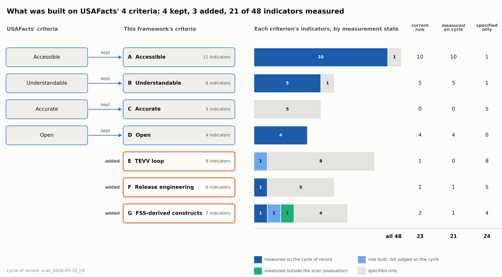
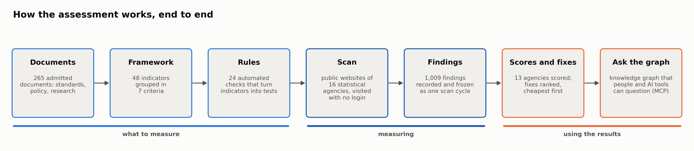
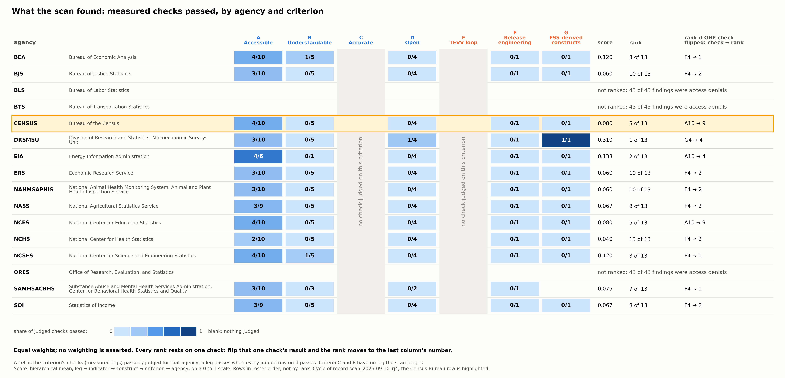

# RESULT: the three summary figures, from the record, each passed through a reader

**Task:** `cc_tasks/2026-10-02_summary_figures.md` (no addenda). **Status:** complete. All three figures shipped and passed the reader gate (figure 3 needed a second round). Launch base `744ed1c8`. The suite, `seldon verify` and the protected-paths diff all ran to their EXIT lines before this file was written. Shipped: `scripts/build_figures.py`, `tests/test_figures.py` (7 tests), and `docs/figures/` (3 SVG, 3 PNG at 300 dpi, 3 captions, `fig3_pass_fail_table.csv`, `numbers.json` ledger, `layout.yaml`).

## 1. Figures and captions (sentence as in each `.caption.md`)
- **Fig 1** `docs/figures/fig1_usafacts_to_framework.{svg,png}`: "4 of USAFacts' four criteria are kept and 3 added, 48 indicators in all, of which 23 have a current rule and 21 are measured on the cycle of record; 24 are specified only." Claims `CL-047`, `CL-046`, `CL-048`, `CL-049`, `CL-050`.
- **Fig 2** `docs/figures/fig2_system_at_a_glance.{svg,png}`: "Documents become a framework of indicators, the indicators become rules, the rules scan 16 statistical agencies' public websites as a visitor with no login, and the 1,009 findings become scores, ranked fixes and a graph people can question." Claims `CL-044`, `CL-046`, `CL-048`, `CL-034`, `CL-051`, `CL-050`, `CL-082`.
- **Fig 3** `docs/figures/fig3_pass_fail_table.{svg,png,csv}`: "Across the 13 ranked agencies most measured checks fail, criteria C and E have nothing the scan judges, and every rank rests on one leg under equal weights; 3 agencies are unranked because the scan's requests were refused." Claims `CL-050`, `CL-053`, `CL-036`, `CL-037`, `CL-041`, `CL-083`.

## 2. Reader gate (decision 5): a fresh subagent given only the PNG under a neutral name in `/tmp/reader_gate/`. Answers verbatim.
- **Fig 1, round 1, agrees.** "An AI-readiness framework kept USAFacts' four data criteria (Accessible, Understandable, Accurate, Open) and added three of its own (TEVV loop, Release engineering, FSS-derived constructs), for 48 indicators in total. The bars show how many of each criterion's indicators were measured on the cycle of record (scan_2026-09-10_rj4) and how many exist only as specifications: Accessible, Understandable and Open are mostly measured, while Accurate and the three added criteria are mostly specified only." / ONE NUMBER: "21 of 48, the number of the framework's indicators actually measured on the cycle of record."
- **Fig 2, round 1, agrees.** "The chart shows how the assessment runs from start to finish in seven steps. Source documents become a framework of indicators, the indicators become automated rules, the rules scan agency websites to record findings, and the findings produce agency scores, ranked fixes and a knowledge graph that people and AI tools can query. The steps fall into three phases: what to measure, measuring, and using the results." / ONE NUMBER: "1,009, the number of findings recorded and frozen in one scan of the public websites of 16 statistical agencies." (Before the gate I removed two labels the record does not support: "each cited to sources", since CL-054 records 16 indicators with no `EVIDENCED_BY` edge, and "pass/fail results", since the findings also include absences and denials.)
- **Fig 3, round 1, disagrees in substance.** "The grid shows, for each of 16 federal statistical agencies, how many measured checks passed under each criterion (Accessible, Understandable, Open, Release engineering, FSS-derived constructs), along with a composite score and a rank out of 13. Nearly every cell is near zero apart from Accessible, which tops out at 4 of 10. Three agencies (BLS, BTS and ORES) are unranked because every finding for them was an access denial, and the Census Bureau, the highlighted row, scores 0.080 and ranks 5 of 13." / ONE NUMBER: "0.310 is the best composite score of any agency (DRSMSU, ranked 1 of 13), so even the leader is about a third of the way to a perfect score." The reader missed that each rank rests on one leg and that C and E have nothing judged. "Tops out at 4 of 10" is also wrong (EIA has 4/6). **Revision:** the flip leg got its own column ("rank if ONE check flipped: check → rank"). The C and E columns are now shaded and labelled "no check judged on this criterion". The equal-weights line is bold.
- **Fig 3, round 2, agrees.** "The chart is a heatmap of 16 federal statistical agencies. For each one it shows how many measured checks passed under each criterion (Accessible, Understandable, Open, Release engineering, FSS-derived constructs), along with an equal-weight score from 0 to 1 and a rank out of 13. Three agencies (BLS, BTS, ORES) are unranked because every finding for them was an access denial, and the Census Bureau row is highlighted at 4/10 Accessible, a score of 0.080 and rank 5 of 13. Every rank would change if a single check flipped." / ONE NUMBER: "0.310, the top score of any agency (DRSMSU, rank 1 of 13) on the 0-to-1 scale." The reader got C and E only implicitly, by leaving them out of its list; nothing it says contradicts the caption.

## 3. Library choice
matplotlib 3.8.4 (anaconda). Mermaid via `mmdc` (`build_brief_deck.py --render-diagrams`) cannot draw proportional bars or a colour-scaled table. Hand-written SVG (`assessment/harness/scan/figures.py`) gives no PNG without a second rasteriser. matplotlib draws all three from one drawing, and its SVG is byte-stable with `svg.hashsalt` fixed, glyphs as paths and the date metadata off. Kept from `figures.py`: rows in roster order, never sorted by score. Colours are the dataviz skill's validated palette; `validate_palette.js` passes, and its contrast WARN is relieved by count labels on every segment.

## 4. Premises the task file got wrong
1. "Measured about a third": the cycle judges **21 of 48** (44%). A third is the record's `measurement_status` count, 16 of 48 (CL-049), which lags the cycle; page H already records that lag. Figure 1 shows the cycle's count, and the caption names the difference.
2. "264 documents": the manifest holds **265** included documents (CL-044). "49 indicators": the figures use **48**, the framework's count; `A12` is a candidate under DD-054. The record has 49 nodes.
3. "Every count from the graph": the counts are read from the framework record and the cycle's matrices through `score.py`, the repo's two-sources rule. Neo4j is not read.
4. The task's three counts overlap: rule ⊇ measured, and `G1-O`, measured by evaluation, is in none of them. Figure 1 therefore draws a four-state partition beside the three numeric columns.
5. The evidence map has no claim for the 21-measured count or for the MCP interface. The captions say so. Page H's "following the OECD/JRC default" is CL-083 `unsupported`, so figure 3 says only "no weighting is asserted".
6. `**After:**` names `2026-10-02_evidence_map_prior_art.md`, which `_v2` superseded. The `_v2` RESULT exists.
7. DN-009 d7 asks for five sentences and one action; decision 5 of this task asks for two sentences and one number. I followed the task.

## 5. Gate (logs under `logs/`, gitignored)
- `tests/test_figures.py`: **7 passed, 0 skipped, 0 xfailed, 0 deselected**. Positive controls: an injected stray numeral and a wrong document count were each caught (run inline, not committed). `scripts/build_figures.py --check`: no drift across 11 files.
- `make gate-fast`: **5 failed, 2892 passed, 3 skipped, 12 xfailed, 27 deselected**; 710 s; EXIT=2 (`2026-10-04_summary_figures_gate_fast.log`).
- Full suite (`pytest tests/ assessment/`): **5 failed, 2919 passed, 3 skipped, 12 xfailed, 0 deselected**; 2406 s; EXIT=1 (`2026-10-04_summary_figures_gate_full.log`).
- The 5 failures are `test_brief_deck`, `test_brief_pack` (×2), `test_g4_resourcing_reissue` and `test_publication`. The same 5 fail at HEAD with this task's files stashed away: **5 failed, 131 passed**, EXIT=1 (`2026-10-04_summary_figures_head_baseline.log`). The scan-catalog RESULT reports the same 5. They are not fixed here; `docs/brief/`, `docs/deck/` and `docs/data/` are outside the write set. A first baseline attempt, in a fresh worktree, is not evidence: the corpus binaries are gitignored and were missing there, and its EXIT line recorded `tail`'s exit code. It was discarded and the log overwritten.
- `seldon verify`: all checks passed, EXIT=0 (`2026-10-04_summary_figures_seldon_verify.log`). Protected paths: nothing outside the write set, EXIT=0 (`2026-10-04_summary_figures_protected.log`). The only other changed file is `seldon_events.jsonl`, a `dispatch_refused` line the dispatcher wrote.

## 6. Spend and network
Model `claude-opus-5-5`. Measured from the transcript at RESULT time (81 turns): 162 input, 65,288 output, 219,176 cache-write and 13,148,904 cache-read tokens. The four reader subagents used 48,882 + 46,937 + 48,602 + 48,571 tokens. There were no other model calls. Network: none beyond `git push`.
