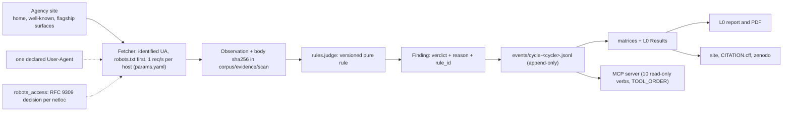
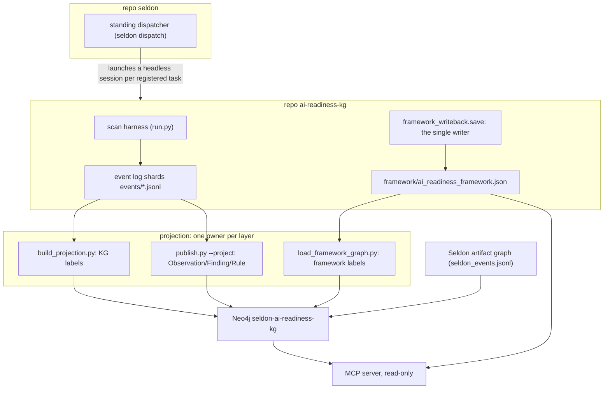
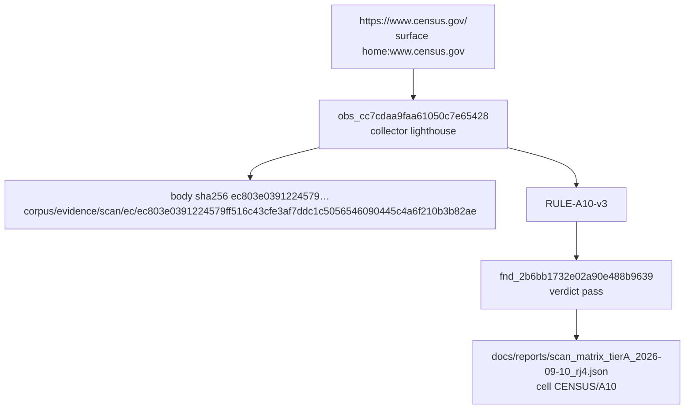
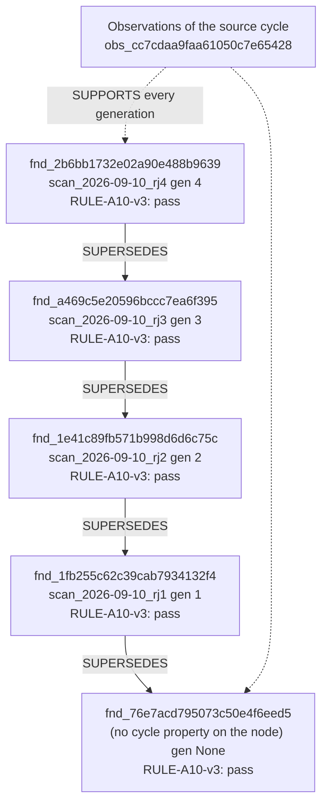

<!-- generated by scripts/build_brief_pack.py (cc_tasks/2026-09-22_brief_material_pack_v2.md); framework record at commit 9ffcffddbf8f (framework/ai_readiness_framework.json, generated_from docs/crosswalk/usafacts_operationalization_skeleton.md); cycle of record scan_2026-09-10_rj4. Do not edit: re-run the generator. -->
# E. Architecture

Four diagrams. Every box names the code it stands for, and the generator resolves each `file:line` against the code when it renders. A box whose code has moved stops the build, so no diagram here is drawn from memory. Each diagram is rendered by `mmdc` in `tests/test_brief_pack.py`.

## (a) Operational view: from an agency site to a published verdict

**How to read it.** Left to right is one cycle. The fetcher is the only part that touches the network. It sends one declared identity, reads robots.txt before anything else on a host, and keeps every response body under its sha256. Rules never fetch: they read Observations and return a Finding. The Findings go to the append-only log, and the matrices, the report, the site and the MCP are read from the log or from what it projects. Dotted arrows are configuration, not data.

| box | code |
|---|---|
| Agency site home, well-known, flagship surfaces | `assessment/harness/scan/run.py:332` |
| Fetcher: identified UA, robots.txt first, 1 req/s per host (params.yaml) | `assessment/harness/scan/manners.py:68` |
| robots_access: RFC 9309 decision per netloc | `assessment/harness/scan/manners.py:35` |
| one declared User-Agent | `assessment/harness/scan/params.yaml:134` |
| Observation + body sha256 in corpus/evidence/scan | `assessment/harness/scan/model.py:171` |
| rules.judge: versioned pure rule | `assessment/harness/scan/rules/__init__.py:405` |
| Finding: verdict + reason + rule_id | `assessment/harness/scan/model.py:217` |
| events/cycle-&lt;cycle&gt;.jsonl (append-only) | `assessment/harness/scan/publish.py:238` |
| matrices + L0 Results | `scripts/build_l0_matrices.py:303` |
| L0 report and PDF | `scripts/build_l0_report.py:315` |
| site, CITATION.cff, zenodo | `scripts/build_l0_site.py:530` |
| MCP server (10 read-only verbs, TOOL_ORDER) | `mcp/airkg_server.py:105` |

## (b) Systems view: processes, stores and the one owner of each layer

**How to read it.** The two stores of record are the event log and the framework record. Neo4j is a projection of both and can be deleted and rebuilt. Each projected layer has exactly one writer. `build_projection.py` resets only the KG labels, `publish.py` owns Observation, Finding and Rule, and `load_framework_graph.py` owns the framework labels (`CLAUDE.md:70`). The framework record itself has one writer, `framework_writeback.save`. Seldon's artifact graph lives in the same database under disjoint labels. The dispatcher is in the Seldon repository and launches one session per registered task. The MCP server reads the record and the projection and writes nothing.

| box | code |
|---|---|
| scan harness (run.py) | `assessment/harness/scan/run.py:503` |
| event log shards events/*.jsonl | `kg/eventlog.py:100` |
| build_projection.py: KG labels | `scripts/build_projection.py:468` |
| publish.py --project: Observation/Finding/Rule | `assessment/harness/scan/publish.py:558` |
| load_framework_graph.py: framework labels | `scripts/load_framework_graph.py:101` |
| framework/ai_readiness_framework.json | `scripts/build_framework_graph.py:319` |
| framework_writeback.save: the single writer | `scripts/framework_writeback.py:302` |
| Neo4j seldon-ai-readiness-kg | `seldon.yaml:4` |
| Seldon artifact graph (seldon_events.jsonl) | `seldon.yaml:3` |
| standing dispatcher (seldon dispatch) | `seldon/seldon/core/dispatch.py:419` |
| MCP server, read-only | `mcp/airkg_server.py:105` |

## (c) Data flow for one verdict: CENSUS, worked from the cycle of record

The leg is `A10`, the one CENSUS's rank rests on (`score.py` concentration, page G). Every value in the diagram is read from `get_body` and `get_evidence` against the projection.

**How to read it.** The URL was fetched once. The Observation carries the response body's digest, and the body sits under that digest in the evidence store. The rule read the Observation and produced the Finding, and the matrix cell names the Finding. A reader can re-hash the stored body and re-run the rule (`assessment/harness/scan/rederive.py`) without touching the network.

| field | value |
|---|---|
| url | https://www.census.gov/ |
| surface | home:www.census.gov |
| observation | obs_cc7cdaa9faa61050c7e65428 |
| observations on the Finding | 2 |
| captured_at | 2026-09-10T17:53:04.219516+00:00 |
| sha256 | ec803e0391224579ff516c43cfe3af7ddc1c5056546090445c4a6f210b3b82ae |
| retained body | corpus/evidence/scan/ec/ec803e0391224579ff516c43cfe3af7ddc1c5056546090445c4a6f210b3b82ae |
| sha256 verified | True |
| rule | RULE-A10-v3 |
| finding | fnd_2b6bb1732e02a90e488b9639 |
| verdict | pass |
| reason | deep link HTTP 200; invalid route correctly HTTP 404; 10518 visible characters present before JS. The pre/post-JS DOM diff the signal also names was NOT run (renderer: none) |
| matrix | docs/reports/scan_matrix_tierA_2026-09-10_rj4.json |

## (d) Judgement generations: re-judgement without re-fetch (DN-003)

**How to read it.** A re-judgement runs the current rules over Observations already on the log and fetches nothing. Its Findings cite the source cycle's `obs_id`s and `SUPERSEDES` their predecessors one to one (`docs/design/2026-09-14_DN-003_event_log_and_rejudgements.md:12`). A Finding with no successor is current. The published report points at the current generation of its snapshot cycle, which is why the report can move to a new judgement without a new scan.

> `docs/design/2026-09-14_DN-003_event_log_and_rejudgements.md:12` 2. **A re-judgement creates no evidence and republishes none.** Its `finding_derived` events cite the source cycle's `obs_id`s, which `publish.write_events` already permits. No Observation is republished, no body is promoted. The re-judged cycle carries `source_cycle`, `supersedes` (the payload it re-judged), `generation` and its `params_hash`, `base_params_hash` and overlay where one exists, so replay recovers exactly what the payload did.

| cycle | publish.generation | publish.supersedes_of | shard |
|---|---|---|---|
| scan_2026-09-10_rj4 | 4 | scan_2026-09-10_rj3 | events/cycle-scan_2026-09-10_rj4.jsonl |
| scan_2026-09-10_rj3 | 3 | scan_2026-09-10_rj2 | events/cycle-scan_2026-09-10_rj3.jsonl |
| scan_2026-09-10_rj2 | 2 | scan_2026-09-10_rj1 | events/cycle-scan_2026-09-10_rj2.jsonl |
| scan_2026-09-10_rj1 | 1 | scan_2026-09-10 | events/cycle-scan_2026-09-10_rj1.jsonl |

Code: `assessment/harness/scan/rederive.py:209`, `assessment/harness/scan/publish.py:100`, `assessment/harness/scan/publish.py:113`, `assessment/harness/scan/publish.py:338`.
